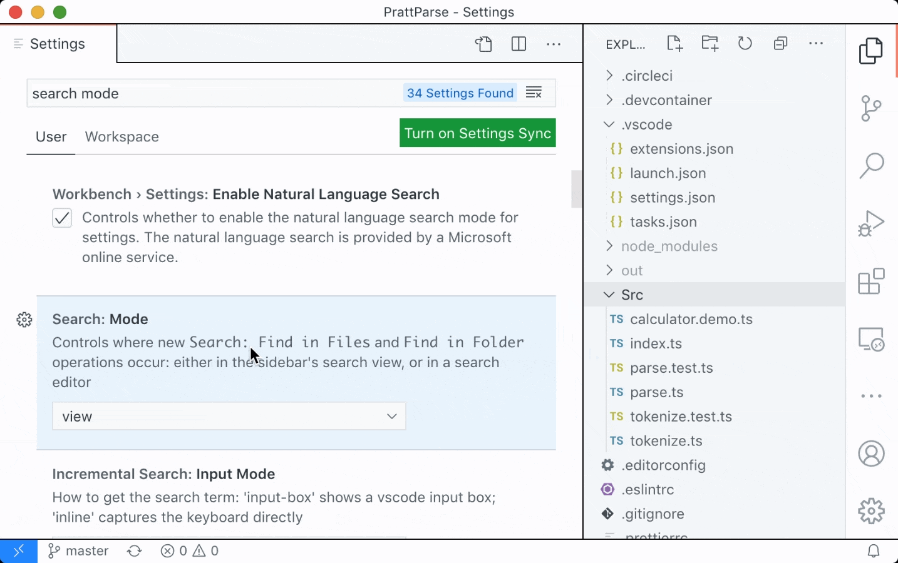

# Janeiro 2021 (version 7628)

<!-- DOWNLOAD_LINKS_PLACEHOLDER -->


Welcome to the January 2021 release of Visual Studio Code. There are a number of updates in this version that we hope you will like, some of the key highlights include:

* **[Wrap tabs](#wrap-tabs)** - Wrap editor tabs in the workbench instead of having a scrollbar.
* **[Configure tab decorations](#tab-decorations)** - Add editor tab status decorations.
* **[Customize search mode](#default-search-mode)** - Use the Search view or open a new Search editor.

>If you'd like to read these release notes online, go to [Updates](https://code.visualstudio.com/updates) on [code.visualstudio.com](https://code.visualstudio.com).

**Join us live** at the [VS Code team's livestream](https://code.visualstudio.com/livestream) on Tuesday, February 9 at 8am Pacific (4pm London) to see a demo of what's new in this release, and ask us questions live.

**Insiders:** Want to try new features as soon as possible? You can download the nightly [Insiders](https://code.visualstudio.com/insiders) build and try the latest updates as soon as they are available.

## Workbench

### Wrap tabs

A new setting `workbench.editor.wrapTabs` lets editor tabs wrap instead of showing a scrollbar.


*Theme: [GitHub Dark Theme](https://marketplace.visualstudio.com/items?itemName=GitHub.github-vscode-theme)*

If the available space for the tabs is too small, wrapping will temporarily turn off, and you will see the old experience with a scrollbar.

**Note:** You can prevent wrapped tabs from growing too large by configuring `workbench.editor.tabSizing: shrink`.

### Tab decorations


Two new settings allow you to configure whether editor tabs show decorations, such as git status or diagnostics. Use `workbench.editor.decorations.colors` to decorate tabs with colors, like red/green for files with errors and warnings, and use `workbench.editor.decorations.badges` to decorate tabs with badges, like **M** for git modified.


*Theme: [GitHub Light Theme](https://marketplace.visualstudio.com/items?itemName=GitHub.github-vscode-theme)*

### Open Editors view hidden by default

The Open Editors view is now hidden by default. This will only affect new VS Code users, and existing users will still see the Open Editors view. We wanted to present a cleaner look in the Explorer view out-of-the-box, and we believe that the functionality provided in the Open Editors view is covered in other areas of the workbench, like tabs. The visibility of the Open Editors view can be controlled by the context menu in the Explorer view title area.


### New confirmation dialogs

If a user tries to quit VS Code while there is a file operation in progress, we now show a confirmation dialog. We also show a confirmation dialog for destructive undo operations from the Explorer.

We always want to avoid data loss, so we've introduced these dialogs to make sure it doesn't happen by accident.


### New setting workbench.editor.enablePreviewFromCodeNavigation

A new setting `workbench.editor.enablePreviewFromCodeNavigation` allows you to explicitly enable preview editors from code navigations, such as **Go to Definition**. In our previous release, we changed the default to open editors normally from code navigations. This setting allows you to choose which option you prefer.

### Emmet performance and feature improvements

Emmet now works much faster in HTML and CSS files. The extension also uses the latest Emmet, meaning that features such as countdowns are now supported.

Here's an example of Emmet expanding with a countdown in a large HTML file, with a 20x performance improvement:


### Improved refactor participants UI

Extensions can participate when you create, move, rename, or delete files. This is useful when automatically running refactorings, for example, when you rename a Java file and also need to rename its public class.


The unified UI allows you to accept, skip, and preview the other changes that an extension is making.

### Open with supports alternative opening mode

After running the **Reopen Editor With** command, you can now hold down `Ctrl` when selecting the editor to use to open the new editor to the side of the current editor. This matches the behavior of VS Code's quick open.

Additionally, pressing `Right Arrow` in the **Reopen Editor With** dialog will now open the editor in the background.

### Issue reporting

If you're signed in with GitHub, you can now directly create issues from the issue reporter (**Help** > **Report Issue**).

### Default search mode

The `search.mode` setting is now available to allow configuring what search UI commands like **Search: Find in Files**, and the explorer's **Find in Folder...** and **Find in Workspace** context menu entries use, with options of:

* `view`: Default existing behavior, search using the search view in the sidebar or panel
* `newEditor`: Search in a new Search Editor
* `existingEditor`: Reusing an existing open Search Editor if one exists, otherwise create a new one

In the past, it was advised to configure default search UI by editing keybindings. This is no longer necessary, and these keybindings can be removed in favor of this setting.


*Theme: [GitHub Light Theme](https://marketplace.visualstudio.com/items?itemName=GitHub.github-vscode-theme)*

### New file and folder icons

We've updated our **New File** and **New Folder** icons to make them consistent with the rest of our [iconography library](https://code.visualstudio.com/api/references/icons-in-labels):


## Editor

### New snippet variables

There are new snippet variables for inserting UUIDs, and for inserting the relative path of the current file. The sample snippet below would print:

`let someId = 'foo/test.js/c13d226f-1932-40e2-9fd9-10198c219e33'`

```json
// sample snippet using UUID and RELATIVE_FILEPATH
{
  "scope": "javascript",
  "prefix": "newVars",
  "body": "let someId = '${RELATIVE_FILEPATH}/${UUID}'$0"
}
```

### Transform to snake case

There is a new command **Transform to Snake Case** that will convert the selected text to [snake case](https://en.wikipedia.org/wiki/Snake_case) (for example, `myVariable` -> `my_variable`).

## Debugging

**Start the same debug configuration multiple times**

We have removed the restriction that only a single debug session can be started from a launch configuration. You can now start multiple concurrent sessions by pressing the green run button in the debug configuration dropdown menu any number of times.

Each subsequent debug session will have a number appended at the end of the name so they can be easily distinguished.


**Breakpoints: condition editing**

We've continued the effort to consolidate and simplify breakpoint editing from the BREAKPOINTS view:

* Condition and hit count editing support has been added for **function** breakpoints. With this condition editing is now available for source-, function-, and exception breakpoints and logpoints.
* You can initiate condition editing from the context menu, or the new inline **Edit Condition** action.

An example of condition editing in the BREAKPOINTS view:


Note that while the new UI supports editing of all breakpoint types, conditions, and hit counts are only respected if a debug extension actually supports them. Currently, we are not aware of any debuggers supporting conditions and hit counts for function breakpoints, but we expect some support soon. For exception breakpoints, condition support has been added to the built-in JavaScript debugger in this release.

**Prompt to save untitled files before run/debug**

A common issue reported by new users who are just getting into programming is forgetting to save files before running them. Since most debuggers cannot debug untitled files (PowerShell being an exception), we now prompt users to save open untitled files in the active editor group before running or debugging.

**Syntax coloring for breakpoint zone widget**

The breakpoint editor zone widget now supports syntax coloring by respecting the language mode of the underlying editor.


**Debug console action moved into secondary menu**

In order to make more room for the debug drop-down menu in the debug view, we have moved the **Debug Console** action to the secondary menu (`...`).

In addition, we believe that the need for the action is small given that the debug console opens automatically when a debug session starts.


**Improved logging for extension debugging**

When debugging an extension, calls to `console` APIs are now processed through the built-in JavaScript debugger, which allows for richer representation of complex objects like source mapped stacktraces.


## Thank you

Last but certainly not least, a big _**Thank You**_ to the following people who contributed this month to VS Code:

Contributions to our issue tracking:

* [John Murray (@gjsjohnmurray)](https://github.com/gjsjohnmurray)
* [Andrii Dieiev (@IllusionMH)](https://github.com/IllusionMH)
* [Simon Chan (@yume-chan)](https://github.com/yume-chan)
* [ArturoDent (@ArturoDent)](https://github.com/ArturoDent)
* [Alexander (@usernamehw)](https://github.com/usernamehw)

Contributions to `vscode`:

* [@0dinD](https://github.com/0dinD): Clarify OpenDialogOptions note (#113831) [PR #113998](https://github.com/microsoft/vscode/pull/113998)
* [@a5hk (Ashkan)](https://github.com/a5hk): camelCase/PascalCase to snake_case [PR #110961](https://github.com/microsoft/vscode/pull/110961)
* [@Andre-Fonteles](https://github.com/Andre-Fonteles): Fixed tab switching too fast when wheeling/scrolling [PR #112034](https://github.com/microsoft/vscode/pull/112034)

<!-- In-product release notes styles.  Do not modify without also modifying regex in gulpfile.common.js -->
<a id="scroll-to-top" role="button" title="Scroll to top" aria-label="scroll to top" href="#"><span class="icon"></span></a>
<link rel="stylesheet" type="text/css" href="css/releasenotes.css"/>
